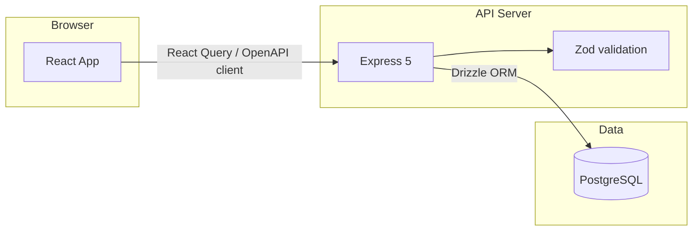

# FreelanceFlow

FreelanceFlow is a self-hosted project and invoice tracker for freelancers who bill clients hourly or per-project. It replaces scattered spreadsheets with a single dashboard showing what was worked, what was billed, and whether each project is profitable.

## Features

- **Dashboard** — Monthly earnings, outstanding invoices, active projects, hours logged, 12-month revenue chart, and project profitability table
- **Clients** — CRUD with hourly rates, project counts, and detail drawer
- **Projects** — Card grid by status (active / paused / completed) with time and earnings summaries
- **Project detail** — Time entries, profitability bar, invoice creation with auto-numbering (FL-001…), status workflow (draft → sent → paid)
- **Invoice print view** — Browser-printable professional layout at `/invoices/:id/print`
- **Dark / light mode** — Toggle persisted in `localStorage` (`freelanceflow-theme`), defaults to dark

## Tech stack

| Layer | Technology |
|-------|------------|
| Frontend | React 19, Vite, TypeScript, Tailwind CSS v4, shadcn/ui, Framer Motion, Recharts |
| Backend | Node.js, Express 5, TypeScript |
| Database | PostgreSQL, Drizzle ORM |
| Validation | Zod, drizzle-zod |
| API contract | OpenAPI 3.1, Orval (React Query hooks) |
| Monorepo | pnpm workspaces |

## Prerequisites

- **Node.js** 20+
- **pnpm** 9+ (`corepack enable`)
- **PostgreSQL** (e.g. [Supabase](https://supabase.com) with transaction pooler on port 6543)

## Quick start

1. **Clone and install**

   ```bash
   cd freelanceflow
   pnpm install
   ```

2. **Environment**

   ```bash
   cp .env.example .env
   # Edit DATABASE_URL with your Supabase pooler connection string
   ```

3. **Push schema**

   ```bash
   pnpm db:push
   ```

4. **Seed sample data** (optional)

   ```bash
   pnpm db:seed
   ```

5. **Regenerate API client** (after OpenAPI changes)

   ```bash
   pnpm codegen
   ```

6. **Run** (two terminals)

   ```bash
   pnpm dev:api   # http://localhost:8080
   pnpm dev:web   # http://localhost:3000
   ```

## Environment variables

| Variable | Required | Description |
|----------|----------|-------------|
| `DATABASE_URL` | Yes | PostgreSQL connection string (Supabase transaction pooler recommended) |
| `PORT` | No | API port (default `8080`) |
| `NODE_ENV` | No | `development` or `production` |
| `LOG_LEVEL` | No | Log verbosity |
| `SESSION_SECRET` | No | Reserved for future use (no auth in v1) |

See `.env.example` for the exact template.

## Monorepo layout

```
freelanceflow/
├── artifacts/
│   ├── api-server/       # Express 5 API (:8080)
│   └── freelanceflow/    # React + Vite UI (:3000)
├── lib/
│   ├── api-spec/         # openapi.yaml (source of truth)
│   ├── api-client-react/ # Orval-generated React Query hooks
│   ├── api-zod/          # Orval-generated Zod types
│   └── db/               # Drizzle schema + client
├── scripts/
│   └── seed.sql
├── pnpm-workspace.yaml
└── package.json
```

## API overview

All routes are under `/api`:

| Method | Path | Description |
|--------|------|-------------|
| GET | `/api/healthz` | Health check |
| GET | `/api/summary` | Dashboard metrics |
| GET/POST | `/api/clients` | List / create clients |
| PATCH/DELETE | `/api/clients/:id` | Update / delete client |
| GET/POST | `/api/projects` | List (optional `?status=` `?clientId=`) / create |
| PATCH/DELETE | `/api/projects/:id` | Update / delete project |
| GET/POST | `/api/projects/:id/entries` | Time entries |
| PATCH/DELETE | `/api/entries/:id` | Update / delete entry |
| GET/POST | `/api/projects/:id/invoices` | Invoices |
| GET | `/api/invoices/next-number` | Next FL-### number |
| GET/PATCH/DELETE | `/api/invoices/:id` | Invoice detail / update / delete |

OpenAPI source: `lib/api-spec/openapi.yaml`.

## Database

Tables: `clients`, `projects`, `time_entries`, `invoices`. Schema lives in `lib/db/src/schema/`. Migrations are applied via:

```bash
pnpm db:push
```

Seed file: `scripts/seed.sql` (3 clients, 5 projects, 15 time entries, 3 invoices).

## Development

| Command | Description |
|---------|-------------|
| `pnpm dev:api` | API with hot reload (`tsx watch`) |
| `pnpm dev:web` | Vite dev server with `/api` proxy |
| `pnpm codegen` | Regenerate Orval client from OpenAPI |
| `pnpm build` | Build all packages |
| `pnpm db:push` | Push Drizzle schema to database |
| `pnpm db:seed` | Load `scripts/seed.sql` |

The Vite dev server proxies `/api` to `http://localhost:8080`.

## Production build

```bash
pnpm build
cd artifacts/api-server && pnpm start
cd artifacts/freelanceflow && pnpm preview
```

Serve the frontend `dist/` behind a reverse proxy and point API requests to the Express server. Set `VITE_API_URL` at build time if the API is on another origin.

## Architecture



1. `openapi.yaml` defines the contract.
2. Orval generates typed hooks (`@workspace/api-client-react`) and schemas (`@workspace/api-zod`).
3. Express routes validate input with Zod and query via Drizzle.
4. React Query caches and invalidates server state.

## Troubleshooting

| Issue | Fix |
|-------|-----|
| `DATABASE_URL` errors | Copy `.env.example` → `.env` and set a valid pooler URL |
| Empty dashboard | Run API (`pnpm dev:api`) and seed data (`pnpm db:seed`) |
| CORS errors in production | Configure proxy or set `VITE_API_URL` |
| Orval fails | Ensure `artifacts/freelanceflow/tsconfig.json` exists, then `pnpm codegen` |
| `pnpm` not found | Run `corepack enable && corepack prepare pnpm@latest --activate` |

## License

MIT — see [LICENSE](LICENSE).

## Contributing

1. Fork the repository
2. Create a feature branch
3. Update `lib/api-spec/openapi.yaml` for API changes, run `pnpm codegen`
4. Keep changes scoped to the monorepo packages above
5. Open a pull request with a clear description and test plan

No authentication, payments, or email in v1 — see project scope in the initial specification.
